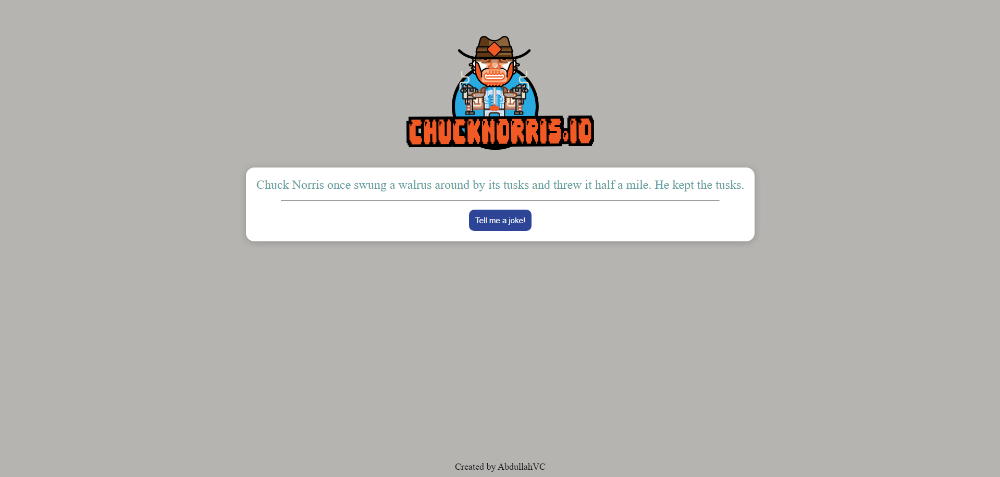

# Chuck Norris Jokes App

Bu proje, Chuck Norris şakalarını rastgele getiren ve kullanıcı etkileşimiyle eğlenceli bir deneyim sunan basit bir web uygulamasıdır. Proje, **HTML**, **CSS**, ve **JavaScript** kullanılarak geliştirilmiştir.

## Özellikler

- Sayfa yüklendiğinde otomatik olarak rastgele bir Chuck Norris şakası gösterilir.
- Kullanıcı "Tell me a joke!" butonuna tıklayarak yeni bir şaka alabilir.
- Şakalar [Chuck Norris API](https://api.chucknorris.io/) üzerinden alınmaktadır.

## Kullanılan Teknolojiler

- **HTML**: Sayfa yapısının oluşturulması.
- **CSS**: Sayfa stilinin tasarlanması.
- **JavaScript**: API çağrılarının gerçekleştirilmesi ve dinamik içerik güncellenmesi.

## Proje Dosyaları

- `index.html`: Uygulamanın ana HTML yapısını içerir.
- `style.css`: Uygulamanın stil düzenlemeleri.
- `app.js`: API ile etkileşim ve dinamik içerik yönetimi.

## Canlı Önizleme

Projenin canlı versiyonuna [buradan](https://marvelous-chebakia-d1c6af.netlify.app/) ulaşabilirsiniz.

## Ekran Görüntüsü



## API

Bu proje, şaka verilerini [Chuck Norris API](https://api.chucknorris.io/) kullanarak alır. API'nin özelliklerini ve dökümantasyonunu incelemek için [burayı](https://api.chucknorris.io/) ziyaret edebilirsiniz.

## Örnek Kod

```javascript
// Sayfa yüklendiğinde ve butona tıklandığında API'den şaka alır.
document.getElementById("jokebtn").addEventListener("click", getAPI);

document.addEventListener("DOMContentLoaded", getAPI);

function getAPI() {
  fetch("https://api.chucknorris.io/jokes/random")
    .then((Response) => Response.json())
    .then((data) => {
      document.getElementById("joke").textContent = data.value;
    })
    .catch((error) => {
      console.error("the joke not displayed:", error);
      document.getElementById("joke").textContent =
        "The joke failed to load, please try again.";
    });
}
```

## Geliştirici

Bu proje, [AbdullahVC](https://github.com/AbdullahVC) tarafından geliştirilmiştir.

---

Keyifli eğlenceler!
